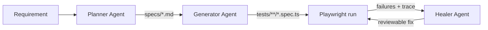

# Demo walkthrough — Requirement → Plan → Spec → Heal

This repository is a working **Playwright MCP agent kit**. The SauceDemo cart flow below is the public proof of the Planner → Generator → Healer loop.



## What you will see in this repo

| Stage | Artefact | Path |
|---|---|---|
| **Planner** | Agent definition | [`.github/agents/playwright-test-planner.agent.md`](../.github/agents/playwright-test-planner.agent.md) |
| **Plan** | Cart page test plan | [`specs/cart-page-test-plan.md`](../specs/cart-page-test-plan.md) |
| **Generator** | Agent definition | [`.github/agents/playwright-test-generator.agent.md`](../.github/agents/playwright-test-generator.agent.md) |
| **Generated spec** | View cart with 3 items | [`tests/cart-functionality/view-cart-multiple-items.spec.ts`](../tests/cart-functionality/view-cart-multiple-items.spec.ts) |
| **Seed** | Generator seed | [`tests/seed.spec.ts`](../tests/seed.spec.ts) |
| **Healer** | Agent definition | [`.github/agents/playwright-test-healer.agent.md`](../.github/agents/playwright-test-healer.agent.md) |

## 1. Requirement (example)

> As a shopper on SauceDemo, I want to add multiple products to the cart and review them on the cart page so I can proceed to checkout with the correct items and count.

## 2. Planner output

The Planner agent explores the app via Playwright MCP and writes a structured plan. Excerpt from the saved plan:

```markdown
#### 1.1. View Cart with Multiple Items
**File:** tests/cart-functionality/view-cart-multiple-items.spec.ts
**Seed:** tests/seed.spec.ts

**Steps:**
1. Navigate to https://www.saucedemo.com/
2. Login with standard_user / secret_sauce
3. Add Backpack, Bike Light, Bolt T-Shirt
4. Open cart
5. Verify 3 items and badge count 3
```

Full plan: [`specs/cart-page-test-plan.md`](../specs/cart-page-test-plan.md).

## 3. Generator output

The Generator agent executes each step on a live browser through MCP, then writes a reviewable Playwright TypeScript spec. Header of the generated file:

```ts
// spec: specs/cart-page-test-plan.md
// seed: tests/seed.spec.ts

test('View Cart with Multiple Items', async ({ page }) => {
  await page.goto('https://www.saucedemo.com/');
  // ... login, add 3 items, assert cart badge === '3'
});
```

## 4. Run the generated suite

```bash
npm ci
npx playwright install --with-deps chromium
npm test
# or a single generated case:
npx playwright test tests/cart-functionality/view-cart-multiple-items.spec.ts
```

## 5. Healer loop (when something fails)

1. Run tests; note failures.
2. Invoke the **Healer** agent (`.github/agents/playwright-test-healer.agent.md`).
3. Healer uses MCP `test_debug` + snapshots to propose locator / assertion fixes.
4. Human reviews the diff — agents propose, engineers approve.

## Human-in-the-loop rule

Generated and healed code is **not** auto-merged. Every change is reviewable TypeScript under `tests/`.

## Record a short demo video (optional)

Suggested 60–90s script for YouTube / LinkedIn:

1. Open `specs/cart-page-test-plan.md` (Planner).
2. Open generated `view-cart-multiple-items.spec.ts` (Generator).
3. Run `npx playwright test tests/cart-functionality/... --headed`.
4. Mention Healer agent path for failure recovery.
5. Point to private AIQA / DeepEVL for enterprise packaging: https://avinash258.github.io/portfolio/#platforms

When published, add the link under [README.md](../README.md) → Demo.
